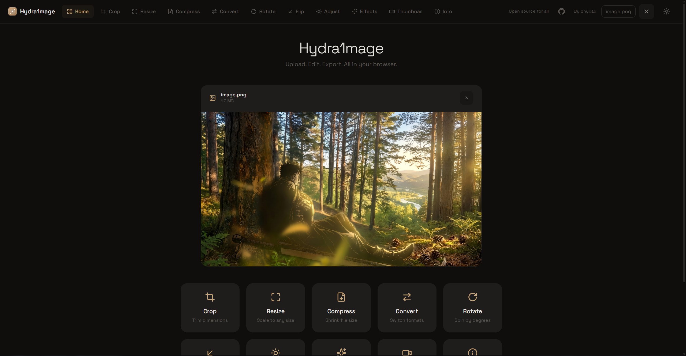
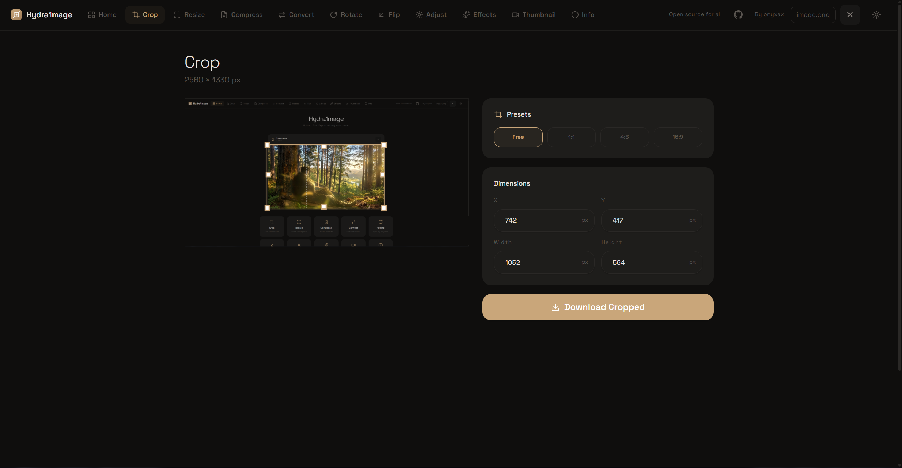
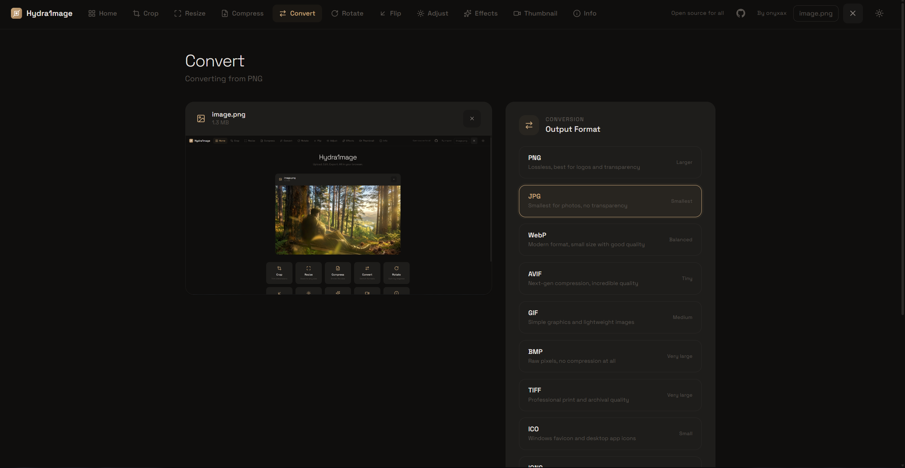
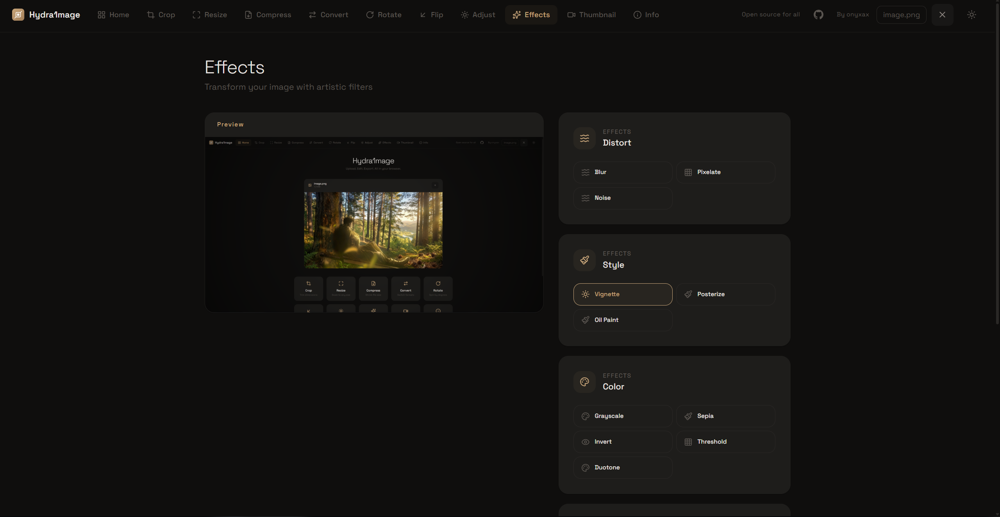

<p align="center">
  
</p>

<h1 align="center">Hydra1mage</h1>

<p align="center">
  <strong>Professional image toolbox — 10 tools, zero uploads, 100% in your browser.</strong><br>
  <span style="color:#888">Crop · Resize · Compress · Convert · Rotate · Flip · Adjust · Effects · Thumbnail · Info</span>
</p>

<p align="center">
  <a href="https://skillicons.dev" target="_blank">
    
  </a>
</p>

<p align="center">
  
  
  
</p>

<p align="center">
  <a href="https://hydra1mage.vercel.app" target="_blank"></a>
  <a href="https://github.com/onyxax/Hydra1mage" target="_blank"></a>
</p>

<p align="center">
  <sub>Privacy-first · No sign-up · No limits · All processing via Canvas API — your files never leave the device.</sub>
</p>

---

## Table of Contents

- [Preview](#preview)
- [Why Hydra1mage](#why-hydra1mage)
- [Features](#features)
- [Tech Stack](#tech-stack)
- [Architecture](#architecture)
- [Design System](#design-system)
- [Project Structure](#project-structure)
- [Getting Started](#getting-started)
- [Scripts](#scripts)
- [Deployment & SEO](#deployment--seo)
- [Contributing](#contributing)
- [Roadmap](#roadmap)
- [License & Credits](#license--credits)

---

<h2> Preview</h2>

###  Home — Dashboard & Search

<p align="center">
  
</p>

Tool groups (Edit / Optimize / Enhance / Inspect), live search, drag-and-drop zone and persistent preview. Pick any tool — your image follows you.

###  Crop — Precision Editor

<p align="center">
  
</p>

Cropper.js powered, free-form + presets (1:1, 4:3, 16:9, 9:16, 21:9), live dimension readout and full-resolution export.

###  Convert — 11 Formats

<p align="center">
  
</p>

PNG, JPG, WebP, AVIF, GIF, BMP, TIFF, ICO, ICNS, SVG, PDF. Quality control and correct ICO headers.

###  Effects — 15 Filters

<p align="center">
  
</p>

Blur, sharpen, emboss, noise, vignette, grayscale, sepia, pixelate, duotone, posterize, edge-detect, oil paint, invert and more.

###  Adjust — Pro Grade

<p align="center">
  
</p>

6 presets (Natural / Bright / Warm / Cool / Vivid / Dramatic) + 8 sliders (exposure, temperature, tint, highlights, shadows, vibrance, gamma, sharpness) with live preview.

###  Info — Metadata Dashboard

Dominant palette (click to copy HEX), brightness distribution, quick stats, file / dimension / technical breakdown — computed locally.

---

<h2> Why Hydra1mage</h2>

| Principle | How it’s enforced |
|---|---|
| ** Privacy-first** | No upload. Every operation uses `Canvas`, `createObjectURL`, `toBlob` in the browser. |
| ** Instant** | Turbopack dev, 11 static routes, no server round-trip. |
| ** Professional** | Deep modules, typed APIs, consistent design tokens. |
| ** Accessible** | Keyboard `Ctrl+Z` / `Ctrl+Y`, ARIA labels, `prefers-color-scheme` auto theme. |

---

<h2> Features</h2>

| # | Tool | Route | Highlights |
|---|---|---|---|
| 1 | **Crop** | `/crop` | Cropper.js, ratio presets, live preview |
| 2 | **Resize** | `/resize` | Locked aspect, presets 25%–200% & 512/1024/1920 |
| 3 | **Compress** | `/compress` | Smart binary-search to target KB + manual slider |
| 4 | **Convert** | `/convert` | 11 formats, quality control |
| 5 | **Rotate** | `/rotate` | Presets 90/180/270/-90 + free angle -180→180 |
| 6 | **Flip** | `/flip` | Horizontal / Vertical / Both |
| 7 | **Adjust** | `/adjust` | 8 sliders + 6 presets, hold-to-compare |
| 8 | **Effects** | `/effects` | 15 effects, search + category pills |
| 9 | **Thumbnail** | `/extract-thumbnail` | 5 YouTube resolutions, preview + download |
| 10 | **Info** | `/info` | Palette, histogram, EXIF & efficiency |

**Global:** Floating dock (`xl` only) — History (undo/redo/jump, branching, persist), File (Save/Copy/Clear), Source (GitHub), System (Theme).

---

<h2> Tech Stack</h2>

<p align="center">
  <a href="https://skillicons.dev">
    
  </a>
</p>

| Layer | Choice | Notes |
|---|---|---|
| **Framework** | **Next.js 16** | App Router, Turbopack, per-route metadata |
| **UI** | **React 19** + **TypeScript 5** | Strict, atomic `ImageContext` |
| **Styling** | **Tailwind CSS 4** | CSS vars `--bg-*` `--accent` |
| **Icons** | **Lucide React** | Tree-shakable, 340+ icons via `lucide-static` CDN |
| **Canvas** | **Canvas API** | `core.ts` — no WASM |
| **Crop** | **Cropper.js 1.5** | CDN, lazy-loaded |
| **Analytics** | **Vercel Analytics** | Privacy-friendly |
| **Deploy** | **Vercel** | Static, edge |

---

<h2> Architecture</h2>

###  Deep Modules `src/lib/image/`

Split from 1116-LOC `image-utils.ts` into focused facade:

```
lib/image/
  core.ts       # loadImage, ObjectURL lifecycle, downloadBlob
  geometry.ts   # dimensions, aspect, orientation
  compress.ts   # binary-search quality
  convert.ts    # 11 formats, ICO header
  adjust.ts     # 8-prop pipeline
  effects.ts    # 15 filters
  info.ts       # 100px sample, dominant colors, brightness
  history.ts    # ImageHistory (MAX 20, branching, persist)
  index.ts      # barrel
```

###  State `ImageContext`

- Single `historyRef: ImageHistory` — no scattered states
- Atomic `{file, url}` with `useRef` + `useEffect` revoke
- `handleFileSelect / Clear / Undo / Redo / Jump` + `Ctrl+Z` / `Ctrl+Y`

###  Hooks

- `useImageLoader` — safe dimensions
- `useCanvasPreview` — canvas lifecycle

###  Components

```
navigation/  nav-items.ts, Logo.tsx, DesktopTopBar.tsx, MobileNav.tsx, FloatingDock.tsx (68px, timeline)
shared/      ToolLayout.tsx, ToolHeader.tsx, ImagePreview.tsx, CanvasPreview.tsx
tools/       AdjustTool.tsx, EffectsTool.tsx, InfoTool.tsx, ...
```

---

<h2> Design System</h2>

- **Tokens** `globals.css`: `--bg-primary / --bg-elevated`, `--text-primary / -muted`, `--border`, `--accent`
- **Theme**: blocking `ThemeScript` in `<head>` + `matchMedia` listener — no FOUC
- **Cards**: `rounded-[20px]` (dock `18px`), `border`, `backdrop-blur`
- **Dock**: `68px` wide, `6px` padding, `HISTORY/FILE/SOURCE/SYSTEM` pills, timeline panel `300px`
- **Type**: `Space Grotesk` + `JetBrains Mono`

---

<h2> Project Structure</h2>

```
Hydra1mage/
├── public/ (favicon.svg, robots.txt, sitemap.xml, screenshots/)
├── src/
│   ├── app/ (layout.tsx, page.tsx, globals.css, crop/ resize/ compress/ convert/ rotate/ flip/ adjust/ effects/ extract-thumbnail/ info/)
│   ├── components/ (navigation/, shared/, tools/, DropZone.tsx, Sidebar.tsx, ThemeInit.tsx)
│   ├── hooks/ (useImageLoader.ts, useCanvasPreview.ts)
│   └── lib/ (image/*, image-context.tsx, format.ts)
├── eslint.config.mjs
├── vitest.config.mjs
└── package.json
```

---

<h2> Getting Started</h2>

### Prerequisites

- Node.js 18+ (20 recommended)
- npm / yarn / pnpm

### Installation

```bash
git clone https://github.com/onyxax/Hydra1mage.git
cd Hydra1mage
npm install
npm run dev
```

Open http://localhost:3000

### Production

```bash
npm run build   # 11 static routes, typecheck
npm run start
```

---

<h2> Scripts</h2>

| Script | Purpose |
|---|---|
| `npm run dev` | Next dev (Turbopack) |
| `npm run build` | Production build |
| `npm run start` | Serve build |
| `npm run lint` | ESLint |

---

<h2> Deployment & SEO</h2>

- **Vercel** — `vercel.json`, static output
- **Per-route** `layout.tsx` metadata (OG `1200×630`, Twitter, canonical)
- **Root** `layout.tsx`: `metadataBase`, `robots`, `verification.google`, `JSON-LD` `WebApplication` with 10-item `featureList`
- **Assets**: `robots.txt`, `sitemap.xml`, `favicon.svg`

---

<h2> Contributing</h2>

PRs welcome!

```bash
git checkout -b feature/my-feature
git commit -m "feat: my feature"
git push origin feature/my-feature
# open PR against main
```

Keep it client-side, follow `var(--*)` tokens and `ToolHeader`/`ToolCard` primitives.

---

<h2> Roadmap</h2>

- [ ] Batch queue for resize/compress
- [ ] WASM AVIF tuning
- [ ] Export presets & history polish
- [ ] Cmd+K palette
- [ ] PWA offline

---

<h2> License & Credits</h2>

- **License:** [MIT](LICENSE)
- **Author:** **onyxax** — https://guns.lol/onyxax
- **Crop engine:** [Cropper.js](https://github.com/fengyuanchen/cropperjs)

<p align="center">
  <sub>Made with care — open source, privacy-first. Star the repo if you like it.</sub>
</p>
